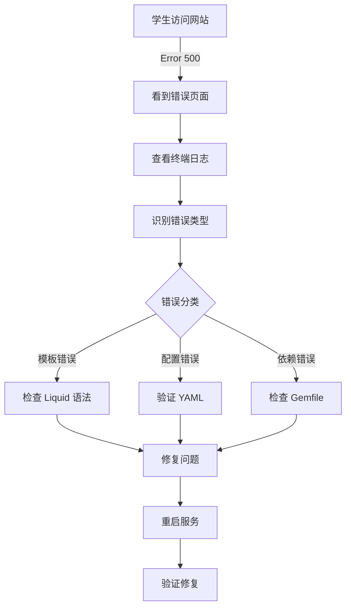

# EC528: 505 错误诊断演示方案

## 概述
本方案展示如何人为制造 HTTP 500/505 服务器错误，并通过查看日志来诊断和修复问题。

---

## 场景 1: Liquid 模板语法错误 ⭐ 推荐

### 原理
Jekyll 使用 Liquid 模板引擎。模板语法错误会导致构建失败，服务器返回 500 错误。

### 制造错误步骤

**在 `_layouts/ec440.html` 中引入错误：**

```liquid
<!-- 原始代码（正常） -->
<h1>{{ page.title }}</h1>

<!-- 改成这样（错误） -->
<h1>{{ page.title | undefined_filter }}</h1>
```

或者更明显的：
```liquid
<!-- 缺失 endif -->

  <h1>{{ page.title }}</h1>

 故意注释掉 endif 
```

### 预期日志输出
```
Liquid Exception: undefined method `undefined_filter' for...
  jekyll 4.x.x | Error: undefined method `undefined_filter'
  
Error: Run jekyll build with --trace for more information.
```

### 诊断步骤
```bash
# 1. 带追踪信息重建
bundle exec jekyll build --trace

# 2. 查看完整错误消息
# 日志会显示具体文件路径和行号

# 3. 常见过滤器问题
#    - {{ var | undefined_filter }}
#    - 检查 Liquid 文档中支持的过滤器列表
```

---

## 场景 2: 配置文件错误 ⭐⭐ 高难度

### 原理
`_config.yml` 的 YAML 语法错误会导致服务器启动失败。

### 制造错误步骤

在 `_config.yml` 中：
```yaml
# 原始代码（正确的 YAML）
title: "EC528: Cloud Computing"
paginate: 5

# 改成这样（YAML 语法错误）
title: "EC528: Cloud Computing
paginate: 5
# 注意：缺少关闭引号
```

或者：
```yaml
# 缩进错误
title: "EC528"
 paginate: 5  # 多余的空格导致嵌套不正确
```

### 预期日志输出
```
Configuration file: /path/_config.yml
             Source: /path
        Destination: /path/_site
      Generating...
          Dependency: Utf8Converter has invalid byte sequence in UTF-8
  Liquid Exception: YAML syntax error in _config.yml
  
Error: YAML syntax error
```

### 诊断步骤
```bash
# YAML 验证工具
ruby -ryaml -e 'puts YAML.load(File.read("_config.yml"))'

# 或使用在线工具
# https://www.yamllint.com/

# Jekyll 输出会指示具体行号
```

---

## 场景 3: 数据文件错误

### 原理
`_data/` 目录中的 YAML/JSON 文件错误会导致构建失败。

### 制造错误步骤

编辑 `_data/spring26_lecture.yml`：
```yaml
# 原始格式
- lecture: 1
  topic: Introduction

# 改成这样（缺失值）
- lecture: 1
  topic:  # 空值会导致列表解析错误
  
- lecture: 2
  topic: "Unclosed string
```

### 诊断步骤
```bash
# 验证 YAML 语法
ruby -ryaml -e 'puts YAML.load_file("_data/spring26_lecture.yml")'
```

---

## 场景 4: 插件/依赖冲突 ⭐⭐⭐ 最真实

### 原理
Gemfile 中的 gem 版本冲突或缺失依赖导致服务器容器错误。

### 制造错误步骤

编辑 `Gemfile`：
```ruby
# 原始
gem "jekyll", "~> 4.2.0"
gem "minimal-mistakes-jekyll"

# 改成（版本不兼容）
gem "jekyll", "3.9.0"  # 太旧
gem "minimal-mistakes-jekyll", "4.24.0"  # 需要 Jekyll 4.x
```

### 诊断步骤
```bash
# 检查依赖树
bundle exec bundle viz --file Gemfile.png

# 更新并查看冲突
bundle update --dry-run

# 可以看到具体的版本冲突信息
```

---

## 最佳演示方案：组合场景

### 推荐步骤流程

```
1️⃣  制造错误（场景 1 - Liquid 模板错误）
    └─ 修改一个模板文件，引入 undefined filter

2️⃣  观察症状
    $ bundle exec jekyll serve
    ❌ Liquid Exception: undefined method...
    📍 指向具体文件和行号

3️⃣  查看日志细节
    $ bundle exec jekyll build --trace
    └─ 完整的堆栈跟踪

4️⃣  诊断问题
    - 定位错误文件
    - 分析错误类型
    - 查阅 Liquid 文档

5️⃣  修复问题
    - 使用正确的过滤器
    - 重新启动服务器
    ✅ 服务正常

6️⃣  分析根因
    - 为什么会发生这个错误？
    - 如何预防？
    - 测试策略？
```

---

## 日志分析清单

### 立即检查的 3 个关键点

| 检查项 | 位置 | 含义 |
|--------|------|------|
| **Error type** | `Liquid Exception:` 或 `Error:` | 错误类别 |
| **File & Line** | 文件路径 + 行号 | 问题位置 |
| **Suggestion** | 最后一行 | 解决提示 |

### 常见错误代码与含义

```
❌ Liquid Exception: undefined method
   → Liquid 过滤器不存在或语法错误

❌ YAML syntax error  
   → 配置/数据文件格式错误

❌ Gem::LoadError
   → 缺失或冲突的 Ruby 依赖

❌ Connection refused
   → 端口被占用或权限问题

❌ File not found
   → 缺失文件或路径错误
```

---

## 进阶：完整日志分析演示

### 启用详细日志

```bash
# 方法 1: 带 trace 标志
bundle exec jekyll build --trace --verbose

# 方法 2: 设置环境变量（最详细）
JEKYLL_LOG_LEVEL=debug bundle exec jekyll serve
```

### 日志输出示例

```
Configuration file: /Users/yigonghu/work/BU/teaching/ec528/website/_config.yml
             Source: /Users/yigonghu/work/BU/teaching/ec528/website
        Destination: /Users/yigonghu/work/BU/teaching/ec528/website/_site
      Liquid Exception: undefined method `undefined_filter' 
      in _layouts/ec440.html, line 5

  Liquid Exception: undefined method `undefined_filter' for...
  jekyll 4.2.0 | Error: undefined method `undefined_filter'
  
  Error: Run jekyll build with --trace for more information.
  
Traceback (most recent call last):
        from /Users/yigonghu/.gem/ruby/2.7.0/gems/liquid-4.0.3/lib/liquid/conditions.rb:96:in `invoke_method'
        from ... [完整堆栈]
```

---

## 推荐的教学流程



---

## 快速参考：5分钟演示脚本

```bash
# 【错误演示】
# 1. 用注释掉 endif 的方式破坏模板
vim _layouts/ec440.html
# → 注释掉 endif

# 2. 尝试启动服务
bundle exec jekyll serve
# → ❌ 显示 Liquid Exception

# 【诊断步骤】
# 3. 带 trace 重新构建
bundle exec jekyll build --trace
# → 找到具体行号和错误

# 【修复步骤】
# 4. 打开文件查看
vim _layouts/ec440.html
# → 找到缺失的 endif
# → 添加回来

# 【验证修复】
# 5. 重新启动服务
bundle exec jekyll serve
# → ✅ 服务正常
```

---

## 思考题

给学生的讨论问题：

1. 为什么 Jekyll 在模板中的错误会导致整个服务器 error?
2. 日志中的哪些信息对诊断最关键？
3. 如何设计测试来预防这类错误？
4. 在生产环境中，应该如何处理这类错误？
5. CDN / 缓存会如何影响错误诊断？

